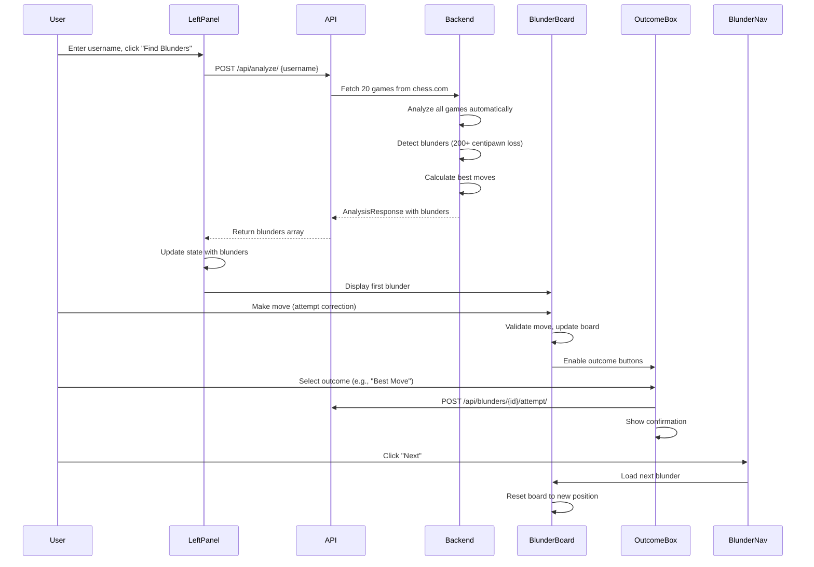

# Chess Blunder Analysis Web App - Updated Architecture Plan

## Overview

A Django REST API backend with React TypeScript frontend that automatically analyzes chess.com games for blunders. The core flow: user enters username, clicks "Find Blunders", system fetches 20 most recent games and automatically analyzes them all. UI features a persistent chessboard with left control panel and right information/outcome panel.

## Core User Flow

1. User enters chess.com username
2. User clicks "Find Blunders" button
3. System fetches up to 20 most recent games from chess.com
4. System **automatically analyzes all games** for blunders (no manual per-game analysis)
5. Default blunder detection: moves that lose 200+ centipawns (2 pawns)
6. For each blunder, best move is calculated and stored automatically
7. User navigates through blunders, attempts to correct them on the board, and selects outcome

## Backend Architecture

### Core Structure

```javascript
backend/
├── config/           # Django settings
├── api/              # REST API endpoints (Django REST Framework)
├── core/             # Core domain models
├── services/         # Business logic
│   ├── chess_com.py  # Chess.com API client
│   ├── analyzer.py   # Blunder detection engine
│   └── stockfish.py  # Stockfish integration wrapper
```


### Data Models (`backend/core/models.py`)

**Game Model**

- `chess_com_id`: String (unique identifier from chess.com)
- `pgn`: Text (full game notation)
- `white_player`: String
- `black_player`: String
- `white_elo`: Integer (nullable)
- `black_elo`: Integer (nullable)
- `result`: String
- `time_control`: String
- `game_type`: String (rapid, blitz, etc.)
- `played_at`: DateTime
- `metadata`: JSONField (flexible storage)
- `analyzed_at`: DateTime (nullable)
- `analysis_status`: String (pending, completed, failed)

**Blunder Model**

- `game`: ForeignKey to Game
- `move_number`: Integer
- `fen_before`: String (position before blunder)
- `fen_after`: String (position after blunder)
- `actual_move`: String (SAN notation - the blunder move)
- `best_move`: String (SAN notation - what should have been played)
- `player_color`: String ('white' or 'black')
- `eval_before`: Float (centipawns)
- `eval_after`: Float (centipawns)
- `eval_delta`: Float (negative value, how much evaluation dropped)
- `blunder_type`: String (enum: 'blunder', 'mistake', 'inaccuracy')
- `severity`: Float (0-1, calculated based on eval_delta)
- `time_taken`: Integer (seconds, nullable - from game clock data)
- `analysis_params`: JSONField (stores detection criteria used)
- `continuations`: JSONField (stores best line continuations, nullable for v1)
- `created_at`: DateTime

**PlayerAttempt Model** (for tracking user corrections)

- `blunder`: ForeignKey to Blunder
- `attempted_move`: String (SAN notation of user's attempt)
- `outcome`: String ('best_move', 'was_blunder', 'neither')
- `attempted_at`: DateTime

### Services Layer

**Chess.com Service** (`backend/services/chess_com.py`)

- `fetch_user_games(username, limit=20)`: Returns list of Game objects
- `parse_pgn(pgn_string)`: Extracts game metadata including ELO, time control, move times
- Integrates existing `chess_api.py` function

**Analyzer Service** (`backend/services/analyzer.py`)

- `analyze_games_batch(games, blunder_params)`: Analyzes multiple games automatically
- `analyze_game(game, blunder_params)`: Analyzes single game
- `detect_blunders(moves, player_color, blunder_params)`: Core detection logic
- Default `blunder_params`: `{'min_eval_delta': 200, 'depth': 15}`
- Only analyzes moves made by the specified player (not opponent)

**Stockfish Service** (`backend/services/stockfish.py`)

- Wrapper around Stockfish executable
- `evaluate_position(fen, depth)`: Returns evaluation in centipawns
- `get_best_move(fen, depth)`: Returns best move (SAN) and continuation
- `get_continuation(fen, moves, depth)`: Returns line continuation (for future use)

### API Endpoints (`backend/api/views.py`)

**REST API Structure** (Django REST Framework)

```javascript
POST /api/analyze/                    # Main endpoint: username -> fetch & analyze games
GET  /api/blunders/                    # Get all blunders (with optional filters)
GET  /api/blunders/{id}/               # Get specific blunder details
POST /api/blunders/{id}/attempt/       # Record player's correction attempt
GET  /api/blunders/{id}/next/          # Get next blunder (for navigation)
GET  /api/blunders/{id}/previous/      # Get previous blunder (for navigation)
```

**Main Analysis Endpoint** (`POST /api/analyze/`)Request:

```json
{
  "username": "player123",
  "blunder_params": {
    "min_eval_delta": 200,
    "depth": 15
  }
}
```

Response:

```json
{
  "games_analyzed": 20,
  "blunders_found": 45,
  "blunders": [
    {
      "id": 1,
      "game_id": 5,
      "move_number": 23,
      "fen_before": "r1bqkb1r/pppp1ppp/2n2n2/4p3/2B1P3/5N2/PPPP1PPP/RNBQK2R w KQkq - 4 4",
      "fen_after": "...",
      "actual_move": "Qd4",
      "best_move": "Qe5",
      "player_color": "white",
      "eval_before": 150,
      "eval_after": -350,
      "eval_delta": -500,
      "blunder_type": "blunder",
      "severity": 0.85,
      "time_taken": 12,
      "game": {
        "id": 5,
        "opponent": "opponent456",
        "played_at": "2024-01-15T10:30:00Z",
        "white_elo": 1500,
        "black_elo": 1520,
        "result": "0-1",
        "time_control": "600+5"
      }
    }
  ]
}
```

**Blunder Detail Response**

```json
{
  "id": 1,
  "game_id": 5,
  "move_number": 23,
  "fen_before": "...",
  "fen_after": "...",
  "actual_move": "Qd4",
  "best_move": "Qe5",
  "player_color": "white",
  "eval_before": 150,
  "eval_after": -350,
  "eval_delta": -500,
  "blunder_type": "blunder",
  "severity": 0.85,
  "time_taken": 12,
  "game": {
    "opponent": "opponent456",
    "played_at": "2024-01-15T10:30:00Z",
    "white_elo": 1500,
    "black_elo": 1520,
    "result": "0-1",
    "time_control": "600+5"
  }
}
```


## Frontend Architecture

### UI Layout Structure

```javascript
┌─────────────────────────────────────────────────────────────┐
│  Left Panel          │  Center (Chessboard)  │  Right Panel │
├──────────────────────┼───────────────────────┼──────────────┤
│ Username Input       │                       │ [Menu] (v1)  │
│ [Find Blunders]      │   Chessboard          │              │
│                      │   (Always Visible)    │ Move Info:   │
│ [Filters] (v1)       │                       │ - Opponent   │
│ (Greyed Out)         │                       │ - Date       │
│                      │                       │ - ELOs       │
│ [Blunder Def] (v1)   │                       │ - Result     │
│ (Greyed Out)         │                       │ - Time       │
│                      │                       │              │
│                      │                       │ Outcome:     │
│                      │                       │ [Best Move]  │
│                      │                       │ [Was Blunder]│
│                      │                       │ [Neither]    │
│                      │                       │              │
│                      │                       │ [Future:     │
│                      │                       │  Show Cont]  │
│                      │                       │              │
│                      │                       │ [< Prev]     │
│                      │                       │ [Next >]     │
└──────────────────────┴───────────────────────┴──────────────┘
```


### Component Structure

```javascript
frontend/src/
├── api/
│   └── client.ts              # Typed API client
├── types/
│   ├── game.ts                # Game interfaces
│   ├── blunder.ts             # Blunder interfaces
│   └── analysis.ts            # Analysis request/response
├── state/
│   └── store.ts               # State management (Context API)
├── components/
│   ├── Layout/
│   │   ├── LeftPanel.tsx      # Username input, filters, blunder def
│   │   ├── CenterPanel.tsx    # Chessboard wrapper
│   │   └── RightPanel.tsx     # Info, outcome, navigation
│   ├── ChessBoard/
│   │   └── BlunderBoard.tsx   # react-chessboard with blunder logic
│   ├── MoveInfo/
│   │   └── MoveInfoBox.tsx    # Game/move information display
│   ├── OutcomeSelector/
│   │   └── OutcomeBox.tsx     # Three-button outcome selection
│   └── Navigation/
│       └── BlunderNav.tsx     # Prev/Next blunder buttons
└── App.tsx                     # Main app with three-panel layout
```


### Type Definitions

**Blunder Type** (`frontend/src/types/blunder.ts`)

```typescript
interface Blunder {
  id: number;
  game_id: number;
  move_number: number;
  fen_before: string;
  fen_after: string;
  actual_move: string;
  best_move: string;
  player_color: 'white' | 'black';
  eval_before: number;
  eval_after: number;
  eval_delta: number;
  blunder_type: string;
  severity: number;
  time_taken: number | null;
  game: {
    id: number;
    opponent: string;
    played_at: string;
    white_elo: number | null;
    black_elo: number | null;
    result: string;
    time_control: string;
  };
}

interface AnalysisRequest {
  username: string;
  blunder_params?: {
    min_eval_delta?: number;
    depth?: number;
  };
}

interface AnalysisResponse {
  games_analyzed: number;
  blunders_found: number;
  blunders: Blunder[];
}

type OutcomeType = 'best_move' | 'was_blunder' | 'neither';
```


### State Management (`frontend/src/state/store.ts`)

**State Structure:**

```typescript
interface AppState {
  // Analysis state
  username: string;
  isAnalyzing: boolean;
  analysisError: string | null;
  
  // Blunders
  blunders: Blunder[];
  currentBlunderIndex: number;
  currentBlunder: Blunder | null;
  
  // Player interaction
  playerAttemptedMove: string | null;
  selectedOutcome: OutcomeType | null;
  
  // UI state
  filtersEnabled: boolean; // false for v1
  blunderDefEnabled: boolean; // false for v1
}
```


### Component Details

**LeftPanel Component** (`components/Layout/LeftPanel.tsx`)

- Username input field
- "Find Blunders" button (triggers analysis)
- Filter menu (greyed out/disabled for v1)
- Blunder definition selector (greyed out/disabled for v1)
- Shows loading state during analysis

**BlunderBoard Component** (`components/ChessBoard/BlunderBoard.tsx`)

- Uses react-chessboard (wraps chessboardjs)
- Always visible in center panel
- Displays position from `fen_before` of current blunder
- Allows player to make moves (attempt to correct blunder)
- Highlights actual move and best move (visual indicators)
- Prevents moves after outcome is selected (or allows reset)
- Uses chess.js for move validation

**MoveInfoBox Component** (`components/MoveInfo/MoveInfoBox.tsx`)

- Displays game information:
- Opponent username
- Game date
- Player ELO / Opponent ELO
- Game result (who won)
- Time taken to make the blunder move
- Updates when currentBlunder changes

**OutcomeBox Component** (`components/OutcomeSelector/OutcomeBox.tsx`)

- Three buttons:
- "Best Move" - player found the best move
- "That was the blunder" - player identified the blunder move
- "Neither best move nor blunder" - player's move was different
- Disabled until player makes a move on the board
- On selection, sends POST to `/api/blunders/{id}/attempt/`
- Visual feedback for selected outcome

**BlunderNav Component** (`components/Navigation/BlunderNav.tsx`)

- Previous blunder button (disabled on first)
- Next blunder button (disabled on last)
- Shows current position (e.g., "3 of 45")
- Updates currentBlunderIndex in state

### Main App Flow




## Key Implementation Details

### Automatic Batch Analysis

1. **Single API Call**: `POST /api/analyze/` handles everything
2. **Backend Processing**:

- Fetch games from chess.com (limit 20)
- For each game, automatically analyze
- For each move by the player, check if it's a blunder
- Calculate and store best move for each blunder
- Return all blunders in single response

3. **Frontend**: Shows loading state, then displays all blunders

### Blunder Detection Logic

- Only analyze moves made by the specified player (not opponent)
- Default threshold: `eval_delta <= -200` centipawns
- Calculate `eval_delta = eval_after - eval_before`
- Store both actual move and best move (from Stockfish)

### Chessboard Interaction

- Board always shows `fen_before` position of current blunder
- Player can make moves to attempt correction
- After move, outcome buttons become enabled
- Visual indicators (optional v1): highlight squares of actual_move and best_move
- Reset functionality: allow player to try again before selecting outcome

### Navigation

- Blunders stored in array, navigated by index
- Previous/Next buttons update `currentBlunderIndex`
- Board and info panels react to index change
- Can add "Go to blunder #X" input in future

## Extensibility Points

### Future Features (Architecture Ready)

1. **Filters**: `GameFilters` interface already defined, backend accepts filter params
2. **Blunder Definition**: `BlunderParams` extensible, frontend can send custom params
3. **Continuations**: `continuations` JSONField in Blunder model, can add display later
4. **Position Library**: `PositionLibrary` model ready, menu button placeholder exists
5. **Performance Tracking**: `PlayerAttempt` model tracks outcomes, can aggregate later
6. **Eval Bar**: Can add component that reads `eval_before`/`eval_after` from blunder
7. **Move Comparison**: Can add component showing side-by-side actual vs best move

## Implementation Phases

### Phase 1: Core Functionality (v1)

1. Set up Django REST Framework
2. Create Game and Blunder models
3. Implement Chess.com service (integrate `chess_api.py`)
4. Implement Stockfish service wrapper
5. Implement Analyzer service with batch analysis
6. Create `POST /api/analyze/` endpoint
7. Create `POST /api/blunders/{id}/attempt/` endpoint
8. Build three-panel layout (LeftPanel, CenterPanel, RightPanel)
9. Implement BlunderBoard with react-chessboard
10. Implement MoveInfoBox
11. Implement OutcomeBox with three buttons
12. Implement BlunderNav (prev/next)
13. Wire up state management
14. Connect frontend to backend API

### Phase 2: Enhanced Features (Future)

1. Enable filter panel
2. Enable blunder definition selector
3. Add visual indicators on board (highlight moves)
4. Add continuation display
5. Add eval bar
6. Add move comparison view
7. Implement position library
8. Add performance tracking dashboard

## Key Files to Create/Modify

**Backend:**

- `backend/core/models.py` - Game, Blunder, PlayerAttempt models
- `backend/services/chess_com.py` - Chess.com integration
- `backend/services/analyzer.py` - Batch blunder detection
- `backend/services/stockfish.py` - Stockfish wrapper
- `backend/api/views.py` - REST API views (analyze, attempt endpoints)
- `backend/api/serializers.py` - DRF serializers
- `backend/api/urls.py` - API routing
- `backend/config/settings.py` - Add DRF, CORS, Stockfish path

**Frontend:**

- `frontend/src/types/blunder.ts` - Blunder interfaces
- `frontend/src/types/game.ts` - Game interfaces
- `frontend/src/types/analysis.ts` - Analysis request/response
- `frontend/src/api/client.ts` - Typed API client
- `frontend/src/state/store.ts` - Context API state
- `frontend/src/components/Layout/LeftPanel.tsx`
- `frontend/src/components/Layout/CenterPanel.tsx`
- `frontend/src/components/Layout/RightPanel.tsx`
- `frontend/src/components/ChessBoard/BlunderBoard.tsx`